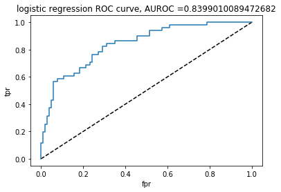
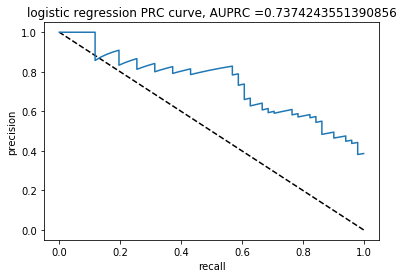
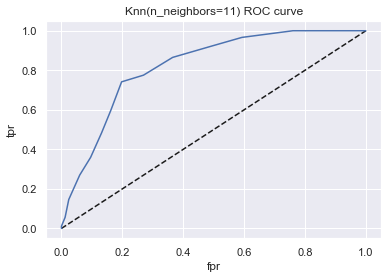
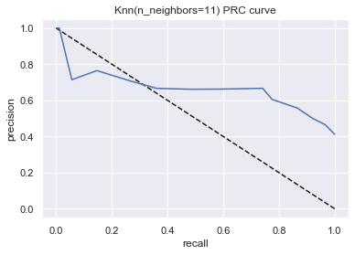

# AUROC-vs-AUPRC

## Diabetes -- Sheryl

Sheryl's data set is diabetes.csv, and the competition is from https://www.kaggle.com/uciml/pima-indians-diabetes-database/kernels?sortBy=voteCount&group=everyone&pageSize=20&datasetId=228&outputType=all&turbolinks%5BrestorationIdentifier%5D=26144c10-5644-4852-b3c4-50264072b98a

### Random Guess Classifier Analysis

The diabetes dataset has a total of 768 samples,  268 of which have positive labels, accounting for a percentage of around 35%. The dimension of the inputs is 8. 

Now we do the random guess classifier analysis. If we are using a random guess classifier, then we will get AUROC = 0.5, AUPRC = 0.35, accuracy less than 0.65. 

### Useful codes

The codes from Sheryl that can generate ROC curve, PRC curve, AUROC, AUPRC, accuracy with best ROC threshold, and save figures as well as give out a numeric report, can be modified from the following:

```python
knn = KNeighborsClassifier(16)
knn.fit(X_train,y_train)
from sklearn.metrics import roc_curve
y_pred_proba =knn.predict_proba(X_test)[:,1]
fpr, tpr, thresholds = roc_curve(y_test, y_pred_proba)
#Area under ROC curve
from sklearn.metrics import roc_auc_score
auroc = roc_auc_score(y_test,y_pred_proba)
plt.plot([0,1],[0,1],'k--')
plt.plot(fpr,tpr, label='logistic')
plt.xlabel('fpr')
plt.ylabel('tpr')
title_name = 'KNN with K = 16 ROC curve, AUROC ='+str(auroc)
plt.title(title_name)
plt.savefig('KNN with K = 16 ROC curve.png')
plt.show()
print('AUROC = ',auroc)
from sklearn.metrics import precision_recall_curve
precision, recall, thresholds = precision_recall_curve(y_test,y_pred_proba)
from sklearn.metrics import auc
auprc = auc(recall, precision)
plt.plot([1,0],[0,1],'k--')
plt.plot(recall,precision, label='logistic')
plt.xlabel('recall')
plt.ylabel('precision')
title_name = 'KNN with K = 16 PRC curve, AUPRC ='+str(auprc)
plt.title(title_name)
plt.savefig('KNN with K = 16 PRC curve.png')
plt.show()
print('AUPRC = ',auprc)
threshold = Find_Optimal_Cutoff(y_test,y_pred_proba)
from sklearn.metrics import accuracy_score
y_pred = y_pred_proba>threshold
accuracy = accuracy_score(y_test, y_pred)

# report of scores
print('AUROC = ',auroc,', AUPRC = ',auprc,'. Best threshold for ROC = ',threshold[0], ', accuracy is then ',accuracy,'.')
```
### KNN with K = 16

The first classifier is KNN with K = 11.The corresponding jupyter notebook file is pima-diabetes-using-logistic-and-knn-84.ipynb. The file edited by Sheryl is pima-diabetes-using-logistic-and-knn-84-Sheryl1020.ipynb, adding PRC curve and AUPRC,  best threshold for ROC, average accuracy, as well as the average precision score.

The scores from the KNN with K = 16 classifier are: AUROC =  0.8721719457013575 , AUPRC =  0.8052043948997956 . Best threshold for ROC =  0.4375 , accuracy is then  0.7922077922077922 .The best threshold is not so close to the proportion of positive data points. Therefore, the result from the KNN classifier with K = 11 is better than the random guess classifier in all the three scores.


​	A visual result for the ROC curve for the KNN classifier  is given in the following figure.

<p align="center">
  
</p>

​	A visual result for the PRC curve for the KNN classifier  is given in the following figure.

<p align="center">
  
</p>

### Logistic Regression

The second classifier is logistic regression. The corresponding jupyter notebook file is pima-diabetes-using-logistic-and-knn-84.ipynb. The file edited by Sheryl is pima-diabetes-using-logistic-and-knn-84-Sheryl1020.ipynb, adding PRC curve and AUPRC,  best threshold for ROC, average accuracy, as well as the average precision score.

The scores from this classifier are: AUROC =  0.8399010089472682 , AUPRC =  0.7374243551390856 . Best threshold for ROC =  0.3647386502429486 , accuracy is then  0.7532467532467533 . The best threshold is quite close to the proportion of positive data points.. Therefore, the result from this classifier is better than the random guess classifier in all the three scores.


​	A visual result for the ROC curve for the logistic classifier  is given in the following figure.

<p align="center">
  
</p>


​	A visual result for the PRC curve for the logistic classifier  is given in the following figure.

<p align="center">
  
</p>

### KNN with K = 11

The third classifier is KNN with K = 11. The corresponding jupyter notebook file is step-by-step-diabetes-classification-knn-detailed.ipynb. The file edited by Sheryl for KNN(K =11) is diabetes_Sheryl_1019.ipynb, adding PRC curve and AUPRC,  best threshold for ROC, average accuracy, as well as the average precision score.

The KNN model uses risk for validation set to choose K. The scores from the KNN with K = 11 classifier are: AUROC = 0.8215367018771446, AUPRC = 0.6622327480790501. The best threshold is 0.35714285714285715, which is quite close to the proportion of positive data points. With this threshold, the average accuracy is 0.78125. Therefore, the result from the KNN classifier with K = 11 is better than the random guess classifier in all the three scores.


​	A visual result for the ROC curve for the KNN classifier  is given in the following figure.

<p align="center">
  
</p>
*ROC curve for the KNN classifier, with AUROC = 0.8215367018771446*
	
​	A visual result for the PRC curve for the KNN classifier  is given in the following figure.

<p align="center">
  
</p>
*PRC curve for the KNN classifier, with AUPRC = 0.6622327480790501*


