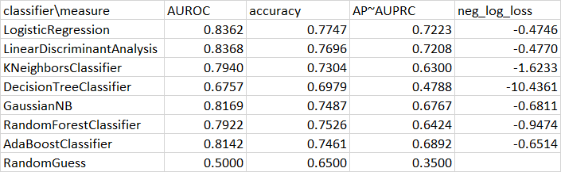

# AUROC-vs-AUPRC

## Diabetes -- Sheryl

Sheryl's data set is diabetes.csv, and the competition is from https://www.kaggle.com/uciml/pima-indians-diabetes-database/kernels?sortBy=voteCount&group=everyone&pageSize=20&datasetId=228&outputType=all&turbolinks%5BrestorationIdentifier%5D=26144c10-5644-4852-b3c4-50264072b98a

A useful guide for choosing ML evaluation metrics can be found in the file how-to-choose-right-metric-for-evaluating-ml-model.ipynb.

### Random Guess Classifier Analysis

The diabetes dataset has a total of 768 samples,  268 of which have positive labels, accounting for a percentage of around 35%. The dimension of the inputs is 8. 

Now we do the random guess classifier analysis. If we are using a random guess classifier, then we will get AUROC = 0.5, AUPRC = 0.35, accuracy less than 0.65. 

### Useful codes

The codes from Sheryl that can generate ROC curve, PRC curve, AUROC, AUPRC, accuracy with best ROC threshold, and save figures as well as give out a numeric report, can be modified from the following:

```python
def Find_Optimal_Cutoff(target, predicted):
    """ Find the optimal probability cutoff point for a classification model related to event rate
    Parameters
    ----------
    target : Matrix with dependent or target data, where rows are observations

    predicted : Matrix with predicted data, where rows are observations

    Returns
    -------     
    list type, with optimal cutoff value

    """
    fpr, tpr, threshold = roc_curve(target, predicted)
    i = np.arange(len(tpr)) 
    roc = pd.DataFrame({'tf' : pd.Series(tpr-(1-fpr), index=i), 'threshold' : pd.Series(threshold, index=i)})
    roc_t = roc.ix[(roc.tf-0).abs().argsort()[:1]]

    return list(roc_t['threshold']) 

X_train, X_test, y_train, y_test = train_test_split(
    X, y, test_size=0.33, random_state=444, stratify=y)

pipe2 = Pipeline([
    ('oversample', SMOTE(random_state=444)),
    ('clf', LinearDiscriminantAnalysis())])

skf2 = StratifiedKFold(n_splits=10)
param_grid = {'clf__n_components': [1]}
grid = GridSearchCV(pipe2, param_grid, return_train_score=False,
                    n_jobs=-1, scoring="roc_auc", cv=skf2)
LDA=grid.fit(X_train, y_train)
from sklearn.metrics import roc_curve
y_pred_proba =LDA.predict_proba(X_test)[:,1]
fpr, tpr, thresholds = roc_curve(y_test, y_pred_proba)
#Area under ROC curve
from sklearn.metrics import roc_auc_score
auroc = roc_auc_score(y_test,y_pred_proba)
plt.plot([0,1],[0,1],'k--')
plt.plot(fpr,tpr, label='LDA')
plt.xlabel('fpr')
plt.ylabel('tpr')
title_name = 'LDA ROC curve, AUROC ='+str(auroc)
plt.title(title_name)
plt.savefig('LDA ROC curve.png')
plt.show()
print('AUROC = ',auroc)
from sklearn.metrics import precision_recall_curve
precision, recall, thresholds = precision_recall_curve(y_test,y_pred_proba)
from sklearn.metrics import auc
auprc = auc(recall, precision)
plt.plot([1,0],[0,1],'k--')
plt.plot(recall,precision, label='LDA')
plt.xlabel('recall')
plt.ylabel('precision')
title_name = 'LDA PRC curve, AUPRC ='+str(auprc)
plt.title(title_name)
plt.savefig('LDA PRC curve.png')
plt.show()
print('AUPRC = ',auprc)
threshold = Find_Optimal_Cutoff(y_test,y_pred_proba)
from sklearn.metrics import accuracy_score
y_pred = y_pred_proba>threshold
accuracy = accuracy_score(y_test, y_pred)

# report of scores
print('AUROC = ',auroc,', AUPRC = ',auprc,'. Best threshold for ROC = ',threshold[0], ', accuracy is then ',accuracy,'.')
```
### KNN with K = 16

The first classifier is KNN with K = 11.The corresponding jupyter notebook file is pima-diabetes-using-logistic-and-knn-84.ipynb. The file edited by Sheryl is pima-diabetes-using-logistic-and-knn-84-Sheryl1020.ipynb, adding PRC curve and AUPRC,  best threshold for ROC, average accuracy, as well as the average precision score.

The scores from the KNN with K = 16 classifier are: AUROC =  0.8721719457013575 , AUPRC =  0.8052043948997956 . Best threshold for ROC =  0.4375 , accuracy is then  0.7922077922077922 .The best threshold is not so close to the proportion of positive data points. Therefore, the result from the KNN classifier with K = 11 is better than the random guess classifier in all the three scores.


​	A visual result for the ROC curve for the KNN classifier  is given in the following figure.

<p align="center">
  
</p>

​	A visual result for the PRC curve for the KNN classifier  is given in the following figure.

<p align="center">
  
</p>

### Logistic Regression

The second classifier is logistic regression. The corresponding jupyter notebook file is pima-diabetes-using-logistic-and-knn-84.ipynb. The file edited by Sheryl is pima-diabetes-using-logistic-and-knn-84-Sheryl1020.ipynb, adding PRC curve and AUPRC,  best threshold for ROC, average accuracy, as well as the average precision score.

The scores from this classifier are: AUROC =  0.8399010089472682 , AUPRC =  0.7374243551390856 . Best threshold for ROC =  0.3647386502429486 , accuracy is then  0.7532467532467533 . The best threshold is quite close to the proportion of positive data points.. Therefore, the result from this classifier is better than the random guess classifier in all the three scores.


​	A visual result for the ROC curve for the logistic classifier  is given in the following figure.

<p align="center">
  
</p>


​	A visual result for the PRC curve for the logistic classifier  is given in the following figure.

<p align="center">
  
</p>

### KNN with K = 11

The third classifier is KNN with K = 11. The corresponding jupyter notebook file is step-by-step-diabetes-classification-knn-detailed.ipynb. The file edited by Sheryl for KNN(K =11) is diabetes_Sheryl_1019.ipynb, adding PRC curve and AUPRC,  best threshold for ROC, average accuracy, as well as the average precision score.

The KNN model uses risk for validation set to choose K. The scores from the KNN with K = 11 classifier are: AUROC = 0.8215367018771446, AUPRC = 0.6622327480790501. The best threshold is 0.35714285714285715, which is quite close to the proportion of positive data points. With this threshold, the average accuracy is 0.78125. Therefore, the result from the KNN classifier with K = 11 is better than the random guess classifier in all the three scores.


​	A visual result for the ROC curve for the KNN classifier  is given in the following figure.

<p align="center">
  
</p>
*ROC curve for the KNN classifier, with AUROC = 0.8215367018771446*
	
​	A visual result for the PRC curve for the KNN classifier  is given in the following figure.

<p align="center">
  
</p>
*PRC curve for the KNN classifier, with AUPRC = 0.6622327480790501*

### Linear Discriminant Analysis(LDA)

The fourth classifier is Linear Discriminant Analysis(LDA). The corresponding jupyter notebook file is a-complete-ml-work-84-roc-auc.ipynb. The file edited by Sheryl is a-complete-ml-work-84-roc-auc-Sheryl1020.ipynb, adding PRC curve and AUPRC,  best threshold for ROC, average accuracy, as well as the average precision score.

The scores from this classifier are: AUROC =  0.8404494382022472 , AUPRC =  0.7040323030097024 . Best threshold for ROC =  0.46555766171966545 , accuracy is then  0.7637795275590551 . The best threshold is not so close to the proportion of positive data points. The result from this classifier is better than the random guess classifier in all the three scores.


​	A visual result for the ROC curve for the LDA classifier  is given in the following figure.

<p align="center">
  
</p>

​	A visual result for the PRC curve for the LDA classifier  is given in the following figure.

<p align="center">
  
</p>

### More Classifiers to Compare
The file edited by Sheryl called a-complete-ml-work-84-roc-auc-Sheryl1020.ipynb contains a comparison for 7 different classifiers and their AUROC, Average Precision(simiar but not the same as AUPRC), Accuracy, with cross validation. The corresponding code is the following:
```python
# added by Sheryl, more classifiers
#scoring =  'accuracy'
seed=7
models = [] # Here I will append all the algorithms that I will use. Each one will run in all the created datasets.
models.append(('LR', LogisticRegression())) 
models.append(('LDA', LinearDiscriminantAnalysis()))
models.append(('KNN', KNeighborsClassifier()))
models.append(('CART', DecisionTreeClassifier()))
models.append(('NB', GaussianNB()))
models.append(('RF', RandomForestClassifier()))
#models.append(('SVM', SVC()))
models.append(('AdaBoost', AdaBoostClassifier()))

#print("evaluation metric: " + scoring)    
results_accuracy=[]
results_auroc=[]
results_average_precision=[]
results_neg_log_loss=[]
names=[]
scores_table = np.zeros([7,4])
i = 0 # looping index
for name, model in models:
        kfold = model_selection.KFold(n_splits=10, random_state=seed)
        cv_results_accuracy = model_selection.cross_val_score(model,X, y, cv=kfold, scoring='accuracy')
        results_accuracy.append(cv_results_accuracy)
        cv_results_auroc = model_selection.cross_val_score(model,X, y, cv=kfold, scoring='roc_auc')
        results_auroc.append(cv_results_auroc)
        cv_results_neg_log_loss = model_selection.cross_val_score(model,X, y, cv=kfold, scoring='neg_log_loss')
        results_neg_log_loss.append(cv_results_neg_log_loss)
        cv_results_average_precision = model_selection.cross_val_score(model,X, y, cv=kfold, scoring='average_precision')
        results_average_precision.append(cv_results_average_precision)
        names.append(name)
        

        # report of scores
        print ("Algorithm :",name)
        print (" Data clean & scaled CV AUROC mean: ", cv_results_auroc.mean())
        print (" Data clean & scaled CV accuracy mean: ", cv_results_accuracy.mean())
        print (" Data clean & scaled CV average_precision mean: ", cv_results_average_precision.mean())
        print (" Data clean & scaled CV neg_log_loss mean: ", cv_results_neg_log_loss.mean())
        scores_table[i, 0] = cv_results_auroc.mean()
        scores_table[i, 1] = cv_results_accuracy.mean()
        scores_table[i, 2] = cv_results_average_precision.mean()
        scores_table[i, 3] = cv_results_neg_log_loss.mean()
        #print('AUROC = ',auroc,', AUPRC = ',auprc,'. Best threshold for ROC = ',threshold[0], ', accuracy is then ',accuracy,'.')
        print ("--"*30)
        i = i + 1
        
print(scores_table)
np.savetxt("scores_table.csv", scores_table, delimiter=",")
```

The results are given below:
<p align="center">
  
</p>


From this table, we can see that AUROC for different classifiers may not differ much, but average precision, which is similar to AUPRC, tells more difference. Therefore, together with the figures and detailed analysis above, AUPRC may be a better measurement in this diabetes dataset. However, while ROC curves look nice for most classifiers, PRC curves may be quite unstable. As a result, it may be useful to use both for model selection. In other words, when we are choosing classifier types, it may be reasonable to use AUROC, and test the model on baseline algorithms. However, when we are fitting our hyperparameters, or when we are improving our classifier, it may be helpful to turn to AUPRC or the Recall-Precision Curve.